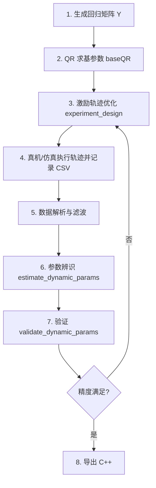

# Dynamic calibration (dynamic parameter estimation) for rigid body manipulator

The code was developed in the framework of the human-robot interaction project at [Innopolis University](https://innopolis.university/en/). One of the outputs of the project was a paper — [Practical Aspects of Model-Based Collision Detection](https://www.frontiersin.org/articles/10.3389/frobt.2020.571574/full), where we provide some review of the recent developments in the field of dynamic calibration, outline the steps required for dynamic parameter identification and provide many useful references. If you have questions from theoretical perspective, please check the paper first. If find paper and code useful, consider citing it in your own papers.

## Required external software

1. [YALMIP](https://yalmip.github.io/) — semidefinite programs (for `PC-OLS` identification)
2. [SDPT3](https://blog.nus.edu.sg/mattohkc/softwares/sdpt3/) — SDP solver
3. MATLAB Symbolic Math Toolbox — symbolic regressor generation (`matlabFunction`)
4. MATLAB Optimization Toolbox — `patternsearch` / `ga` / `fmincon` (trajectory optimization)
5. Python 3 + `scipy` — export regressor / baseQR to C++

---

## 项目概述（Marvin 7-DOF 工程版）

本仓库在原始 UR 辨识框架上，面向 **7 自由度 Marvin 机械臂** 做了工程化扩展，核心观测方程为：

```text
tau = [ Y(q, qd, qdd, g) * E1 ,  Y_fr(qd) ] * [ pi_b ; pi_fr ]
```

| 符号 | 含义 |
|------|------|
| `Y` | 标准惯性回归矩阵，7×70（`autogen/standard_regressor_marvin.m`） |
| `g` | 基座系重力线加速度 [3×1]，竖装常用 `[0; 0; 9.8065]`，侧装需左乘旋转矩阵 |
| `E1` | 基参数映射矩阵，`permutationMatrix(:,1:bb)`，来自 `baseQR_7dof.mat` |
| `pi_b` | 最小惯性参数（当前 **43** 个） |
| `pi_fr` | 摩擦参数（每关节 3 个，共 **21** 个） |

---

## 目录结构

```text
dynamic_calibration-master/
├── main.m                          # 一键入口（基参数 QR + 辨识/验证）
├── experiment_design.m             # 激励轨迹优化（傅里叶+多项式混合轨迹）
├── estimate_dynamic_params.m       # 参数辨识（OLS / PC-OLS / URDF-REFINE），结果自动存入 results/
├── validate_dynamic_params.m       # 辨识结果验证（相对残差 RRE）
├── export_dynamic_params_cpp.m     # 将 pi_b、pi_fr 导出为 C++ 头文件
├── gen_torque_expression.m         # 将 Y_base*pi_b 展开为力矩解析式 → autogen/compute_tau_dyn.m
│
├── Marvin.urdf                     # 机器人模型
├── baseQR_7dof.mat                 # 最小参数集 QR 缓存（E, beta, bb=43）
├── results/                        # 辨识结果自动保存目录（sol_*.mat）
│
├── autogen/                        # 符号生成的快速函数 .m
│   ├── standard_regressor_marvin.m # Y(q,dq,ddq,g) → 7×70
│   └── compute_tau_dyn.m           # tau_dyn(q,dq,ddq,g) → 7×1 (= Y_base*pi_b)
│
├── dynamics/                       # 动力学与 QR
│   ├── base_params_qr.m
│   ├── GenRegNewtonEulerGravity.m  # NE 回归矩阵生成器
│   ├── frictionRegressor.m
│   └── run.m                       # 调用 GenRegNewtonEulerGravity 重新生成 autogen
│
├── trajectory_optmzn/              # 轨迹优化子模块
├── dataset/identification_data/    # 真机/仿真 CSV 示例
├── utils/                          # URDF 解析、滤波、数据处理
├── tests/                          # test_base_params, test_rb_inverse_dynamics
│
├── scripts/                        # Python：MATLAB → C++ 转换
│   ├── convert_tau_dyn_to_cpp.py           # 力矩解析式 → C++
│
├── cpp_ne/                         # C++ 力矩计算（详见 cpp_ne/README.md）
├── simulink/                       # Simulink / Simscape 仿真
└── URe/, XM7p/                     # 其他机器人 URDF 资源
```

---

## 完整工作流程



| 阶段 | 主要脚本/文件 |
|------|----------------|
| 1. 回归矩阵 | `dynamics/run.m` → `autogen/standard_regressor_marvin.m` |
| 2. 基参数 | `base_params_qr` → `baseQR_7dof.mat` |
| 3. 轨迹优化 | `experiment_design.m` |
| 4. 数据采集 | 控制器跟踪优化轨迹，保存 CSV |
| 5. 数据处理 | `parseSimulinkData` + `filterData` |
| 6. 辨识 | `estimate_dynamic_params`（结果自动存入 `results/`） |
| 7. 验证 | `validate_dynamic_params` |
| 8. 导出 C++ | 见下方 |

---

## 使用方法

### 0. 环境准备

```matlab
cd('path/to/dynamic_calibration-master');
addpath(genpath(pwd));
```

### 1. 生成回归矩阵（含重力 g）

```matlab
robot = importrobot('Marvin.urdf');
GenRegNewtonEulerGravity(robot);   % → autogen/standard_regressor_marvin.m
```

### 2. 计算最小参数集（QR）

```matlab
[~, baseQR] = base_params_qr(0, 'baseQR_7dof.mat');
```

### 3. 参数辨识

```matlab
sol = estimate_dynamic_params(path_to_data, [2, 110], baseQR, 'OLS', [], 'time');
% 结果自动保存到 results/sol.mat
```

### 4. 验证

```matlab
rre = validate_dynamic_params(path_to_data, [2, 110], baseQR, sol.pi_b, sol.pi_fr, 'time');
```

### 5. 导出 C++

```matlab
% 生成基回归矩阵符号函数（只需运行一次）
gen_base_regressor('baseQR_7dof.mat')

% 生成力矩解析式（每次辨识参数更新后运行）
gen_torque_expression('results/sol.mat', 'baseQR_7dof.mat')


```

```bash
# 转 C++

python scripts/convert_tau_dyn_to_cpp.py
```

C++ 调用：

```cpp
#include "compute_current.h"

double q[7], qd[7], q2d[7], g[3] = {0, 0, 9.8065}, tau[7];


// 快速版（pi_b 已烘焙进表达式）
compute_joint_torque(q, qd, q2d, g, PI_FR, tau);
```

---

## 常见问题

| 现象 | 处理 |
|------|------|
| `standard_regressor_marvin` 参数个数错误 | 已升级为 4 参数 `(q,dq,ddq,g)` |
| QR 秩与 `bb` 变化 | 删除旧 `baseQR_7dof.mat` 重新运行 `base_params_qr` |
| 辨识 `max\|q\|>360` 警告 | 检查 CSV 角度单位是否为 deg |
| `traj_cost_lgr` 输入参数不足 | `addpath` 时优先 `trajectory_optmzn` |

---

## 参考文献

- [Practical Aspects of Model-Based Collision Detection](https://www.frontiersin.org/articles/10.3389/frobt.2020.571574/full)
- [Inertia Tensor Properties in Robot Dynamics Identification (LMI)](https://www.researchgate.net/profile/Cristovao-Sousa-3/publication/330251436)
- [Global Identification of Joint Drive Gains and Dynamic Parameters](https://asmedigitalcollection.asme.org/dynamicsystems/article-abstract/136/5/051025/370830)
